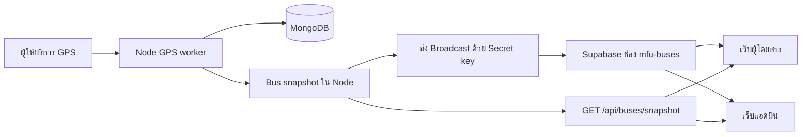

# ใช้งานและพัฒนา Supabase Realtime

คู่มือนี้อธิบายพฤติกรรมที่มีในโค้ดปัจจุบัน อัปเดต 22 กันยายน 2026
เริ่มติดตั้งเครื่องใหม่ที่ [HANDOVER.md](HANDOVER.md)

## ข้อมูลเดินทางอย่างไร



Supabase ไม่ได้ติดตามการเปลี่ยนแปลง MongoDB อัตโนมัติ Node เป็นผู้ส่งหลังจบรอบ GPS
ฐานข้อมูลเดิมและการล็อกอินผ่าน Node JWT ยังคงใช้งาน ไม่ต้องสร้าง Supabase Auth user หรือตารางข้อมูลรถใน Postgres

## ตั้งค่า Supabase ครั้งแรก

1. ใช้โปรเจกต์ Supabase ของทีม หรือสร้างโปรเจกต์สำหรับสภาพแวดล้อมใหม่
2. คัดลอก Project URL และ Publishable key ไปตัวแปร `VITE_SUPABASE_*` ใน root `.env` สำหรับทั้งสองเว็บ
3. คัดลอก Project URL และ Secret key ไป root `.env` สำหรับ Node
4. เปิด [backend-node/sql/realtime.sql](../backend-node/sql/realtime.sql) คัดลอกทั้งหมดไป Supabase → SQL Editor → New query → Run
5. ตรวจว่ามี policy `mfu_bus_receive` และ `mfu_bus_no_client_send` ในผลลัพธ์
6. ใน Realtime Settings ปิด Allow public access หากโปรเจกต์ไม่ต้องใช้ช่องสาธารณะอื่น
7. รีสตาร์ต Node และ Vite ทั้งสองเว็บ

SQL สามารถรันซ้ำเพื่อปรับ policy สองตัวของระบบนี้ โดยไม่ย้ายหรือลบข้อมูล MongoDB
ไม่ต้องเปิด Data API เพื่อใช้ Broadcast และไม่ต้องสร้าง Storage Bucket
รายละเอียดผู้ให้บริการ: [Broadcast](https://supabase.com/docs/guides/realtime/broadcast), [Realtime Authorization](https://supabase.com/docs/guides/realtime/authorization)

## ไฟล์ env

ทุกส่วนใช้ root `.env` ไฟล์เดียว ส่วนสำหรับ Backend:

```env
SUPABASE_URL=https://YOUR_PROJECT.supabase.co
SUPABASE_SECRET_KEY=sb_secret_REPLACE_ME
```

ส่วนสำหรับเว็บทั้งสองใน root `.env` เดียวกัน:

```env
VITE_API_BASE_URL=http://localhost:5101
VITE_SUPABASE_URL=https://YOUR_PROJECT.supabase.co
VITE_SUPABASE_PUBLISHABLE_KEY=sb_publishable_REPLACE_ME
```

ค่าเหล่านี้เป็นตัวอย่าง ต้องแทนด้วยค่าจริงของทีม Secret key ใช้ได้เฉพาะ Node และไม่ต้องส่งให้คนที่ทำเฉพาะ UI
`backend-node/config.js` โหลด root `.env` ให้ API, seed และ scripts; environment ที่กำหนดให้ process อยู่แล้วมีผลก่อนค่าในไฟล์
Vite ทั้งสองเว็บใช้ `envDir` ที่ root และเปิดเผยเฉพาะตัวแปร `VITE_*`
Docker ส่ง Secret key เข้า backend ตอนรัน และส่ง Publishable key เข้า Vite ตอน build

## Protocol ที่โค้ดใช้

| รายการ | ค่า |
|---|---|
| Topic | `mfu-buses` |
| Channel config | `{ private: true }` |
| Event | `buses.updated` |
| Initial/reconnect API | `GET /api/buses/snapshot` |
| API เดิมที่ยังรองรับ | `GET /api/buses` คืน array |
| Diagnostics สำหรับ admin | `GET /api/buses/gps-status` พร้อม JWT admin |

ตัวอย่าง payload (ข้อมูลสมมติ):

```json
{
  "schemaVersion": 1,
  "streamId": "unique-server-instance-id",
  "sequence": 12,
  "capturedAt": "2026-09-16T10:00:00.000Z",
  "buses": [
    {
      "busId": "MFU01",
      "lat": 20.05,
      "lng": 99.89,
      "status": "RUNNING",
      "connectionStatus": "fresh",
      "feedHealthy": true,
      "lastGpsAt": "2026-09-16T09:59:58.000Z"
    }
  ]
}
```

- `streamId` เปลี่ยนเมื่อ Node เริ่มใหม่; `sequence` เพิ่มภายใน instance เดียว
- `capturedAt` คือเวลาสร้าง snapshot; `lastGpsAt` คือเวลาพิกัดจริง ห้ามใช้เวลาได้รับข้อความแทนเวลา GPS
- `buses` เป็นข้อมูลรถทั้งชุด ไม่ใช่เฉพาะคันที่เปลี่ยน ใช้แทนชุดเดิมได้
- Snapshot cache ช่วยให้ผู้ใช้หลายคนแชร์การอ่าน MongoDB; cache หมดอายุ 5 วินาทีหรือถูก refresh โดย GPS worker
- การส่งมี timeout 10 วินาที ถ้ายังส่งอยู่ รอบซ้อนจะถูกข้ามเพื่อไม่สะสมข้อมูลเก่า
- ความล้มเหลวของ Supabase ไม่ทำให้ GPS worker หรือ API เดิมหยุด

## การรับข้อมูลและ fallback

`busFeed.ts` ในเว็บทั้งสองมี logic ชุดเดียวกัน:

1. เริ่ม subscribe พร้อมโหลด snapshot จาก API
2. เก็บ event ที่มาก่อน snapshot และตรวจ sequence ก่อนนำไปใช้
3. เมื่อมี event ใหม่ใน stream เดิม ใช้ payload อัปเดตหมุด/รายการรถโดยตรง ไม่ GET ซ้ำทุก event
4. เมื่อ Node เริ่มใหม่ ยืนยัน stream ใหม่ผ่าน API ก่อนรับชุดใหม่
5. หลัง reconnect, กลับเข้าแท็บ หรือกลับ online ให้โหลด snapshot เพื่อเติมข้อมูลที่พลาด
6. ถ้าไม่มี event เกิน 15 วินาทีหรือ channel ไม่ได้เชื่อม ให้โหลด API ทุก 5 วินาที
7. เมื่อปิด component หรือออกจากระบบ admin จะยกเลิก subscription, timer และ request ที่ค้าง

ไม่มี Supabase env ก็ใช้ API fallback ได้ แต่ถ้าไม่มี backend จะโหลด snapshot ไม่ได้
หน้าแอดมินยังโหลด GPS diagnostics ทุก 30 วินาที และ API สถานี/รายงาน/detector ยังมีรอบโหลดของตนเอง
GET ตอนเปิดหน้าและหลัง reconnect เป็นพฤติกรรมปกติ จำนวน request จึงไม่ได้เป็นศูนย์

## สิทธิ์และการทำงานเป็นทีม

Private ในที่นี้หมายถึงช่องที่ผ่านการตรวจ policy; ข้อมูลรถเป็นข้อมูลที่ผู้โดยสารทั่วไปอ่านได้อยู่แล้ว
policy จึงให้ `anon` และ `authenticated` รับเฉพาะ Broadcast ของ topic รถ และห้าม INSERT ของ client บน topic นี้
ผู้ใช้ไม่ต้องสมัคร Supabase เพื่อดูรถ ตัวส่งหลังบ้านใช้ Secret key

ห้ามเพิ่มข้อมูลบัญชี รายงานส่วนตัว URL กล้อง หรือ token ลงใน payload นี้ หากจะทำ Realtime ของข้อมูลแอดมิน ต้องออกแบบช่องและสิทธิ์แยกต่างหาก

ใช้ backend/GPS worker หนึ่งตัวต่อสภาพแวดล้อม ขณะนี้ snapshot อยู่ในหน่วยความจำ Node
การเปิด worker หลายตัวด้วย Supabase โปรเจกต์เดียวกันจะมีหลาย `streamId` และอาจส่งข้อมูลคนละฐานมาปนกัน
เพื่อนที่ทำ UI ควรชี้ไป backend กลางของทีม หรือใช้ Supabase โปรเจกต์แยกสำหรับเครื่องตนเอง
ก่อนเพิ่มหลาย backend instance ต้องมี shared snapshot/version store และกำหนด worker ที่รับผิดชอบการดึง GPS

## ตรวจว่าทำงานจริง

### 1. API และตัวส่ง

จาก root repository:

```bash
curl http://localhost:5101/health
curl http://localhost:5101/api/buses/snapshot
node backend-node/scripts/check-realtime.js
```

`check-realtime.js` ส่งข้อมูลว่างไปช่องทดสอบส่วนตัวชื่อสุ่ม ไม่ส่งเข้าช่องรถจริง
ผล `{"ok":true}` ยืนยันว่า Supabase รับคำขอ ไม่ได้ยืนยันว่าหน้าบ้านรับ event แล้ว

### 2. ดูใน Chrome

1. เปิดเว็บผู้โดยสารหรือหน้าแอดมินที่ล็อกอินแล้ว
2. คลิกขวาบนหน้าเว็บ → Inspect → Network (บน Mac ใช้ Cmd+Option+I ได้)
3. เลือก WS หรือ Socket แล้วเปิดรายการเชื่อมต่อ Supabase ดู Messages/Frames
4. ค้นหา `buses.updated` ควรมีข้อมูลใหม่ตามรอบ GPS
5. กลับไป Fetch/XHR กรอง `buses/snapshot` ควรมีตอนเริ่มต้น/เชื่อมใหม่ และหยุดยิงซ้ำระหว่างมี event ต่อเนื่อง
6. เปลี่ยน Network เป็น Offline แล้วกลับ No throttling ตรวจว่าข้อมูลกลับมา; โหมด Offline บางเบราว์เซอร์อาจไม่ตัด WebSocket ทันที ให้ดูสถานะและการรับข้อความประกอบ

ตำแหน่งรถอาจไม่ขยับหากรถจอด ให้ดู `sequence` และ `lastGpsAt` ประกอบ
เว็บผู้โดยสารรับจำนวนคนรอผ่าน `public.updated` ในช่องเดียวกัน ดูรายละเอียดด้านล่าง

### 3. ตรวจจากฝั่งแอดมิน

Network → `/api/buses/gps-status` → Response มี `realtime`:

- `configured`: มี URL/key ในรูปแบบที่ตัวส่งรับ ไม่ได้ยืนยันว่าคีย์ถูกต้อง
- `busy`: กำลังส่งหรือไม่
- `lastSuccessAt`: ส่งสำเร็จครั้งล่าสุด
- `lastError`: เช่น `http_401`, `http_403`, `publish_failed`

อย่าคัดลอก Authorization header หรือคีย์ลง issue/public chat

## แก้ปัญหาที่พบบ่อย

| อาการ | ตรวจ/แก้ |
|---|---|
| `Cannot GET /api/buses/snapshot` | backend ยังเป็นโค้ดเก่า รีสตาร์ต Node จาก checkout นี้ |
| snapshot GET ยังยิงทุก 5 วินาที | ดู WS, policy, URL/key และตัวส่ง นี่เป็น fallback ไม่จำเป็นต้องเป็นบั๊ก |
| `http_401` จากตัวส่ง | คัดลอก Secret key value ใหม่ ไม่ใช้ชื่อคีย์หรือ Publishable key |
| subscribe ไม่สำเร็จ/`CHANNEL_ERROR` | ตรวจว่า SQL อยู่โปรเจกต์เดียวกับ URL/key และ topic เป็น `mfu-buses`, `private: true` |
| sender ส่งได้ แต่เว็บเงียบ | เช็ก URL สองเว็บกับ root, policy SELECT และมี event รถจาก GPS worker จริงหรือไม่ |
| `publish_failed` | อาจเป็น network/timeout หรืออ่าน snapshot ไม่สำเร็จ ดูสถานะ MongoDB และลอง check script |
| รถ stale/ETA ไม่มี | ตรวจ GPS จริงตาม [GPS.md](GPS.md); Realtime ไม่ทำให้พิกัดเก่ากลายเป็นใหม่ |
| เปลี่ยน `.env` แล้วไม่เปลี่ยน | รีสตาร์ต Vite/Node; ถ้า Docker ต้อง rebuild เว็บ |
| พอร์ตถูกใช้อยู่ | ปิด process เก่าที่ตนเปิด หรือกำหนดพอร์ตและ `VITE_API_BASE_URL` ให้ตรงกัน |
| Google Maps ไม่ขึ้นแต่ WS ทำงาน | ตรวจ Maps key, referrer และ quota แยกจาก Supabase |

## คำสั่งตรวจสอบโค้ด

รันจาก root repository:

```bash
node --test backend-node/test/bus-snapshots.test.js backend-node/test/gps.test.js backend-node/test/supabase.test.js
node --experimental-strip-types --test frontend-vue/test/busFeed.test.mjs frontend-vue/test/arrival.test.mjs frontend-vue/test/liveGps.test.mjs frontend-vue/test/routePlanning.test.mjs
npm --prefix frontend-vue run build
npm --prefix admin-web run build
git diff --check
```

เป็น unit/integration tests ด้วยข้อมูลทดสอบ; การส่งไป Supabase จริงใช้ check script และการดู WebSocket เพิ่มเติม

## จุดแก้ไขเมื่อพัฒนาต่อ

| งาน | ไฟล์ |
|---|---|
| อ่าน GPS / สุขภาพ feed | `backend-node/services/gps.js` |
| เชื่อม worker กับ publisher | `backend-node/services/gps-runtime.js` |
| cache / sequence | `backend-node/services/bus-snapshots.js` |
| ส่ง Broadcast / timeout | `backend-node/services/supabase.js` |
| HTTP snapshot / diagnostics | `backend-node/routes/bus.routes.js` |
| สิทธิ์ Supabase | `backend-node/sql/realtime.sql` |
| ตั้งค่า client | `src/services/supabase.ts` ของทั้งสองเว็บ |
| subscribe / fallback / ordering | `src/services/busFeed.ts` ของทั้งสองเว็บ |
| ใช้ข้อมูลบนหน้าจอ | `src/App.vue` ของทั้งสองเว็บ |

ถ้าแก้ protocol/fallback ต้องแก้ `busFeed.ts` ทั้งสองชุดและทดสอบทั้งคู่
จำนวนคนรอของเว็บผู้โดยสารใช้ `publicDataFeed.ts` โดยรับ event ผ่าน `busFeed.ts` ช่องเดียวกัน ส่วนเว็บแอดมินยังใช้ API สถานีเดิม
Broadcast ไม่ได้เก็บประวัติให้แอปเรียกคืน; API snapshot ยังจำเป็นสำหรับผู้ใช้ใหม่และการเชื่อมต่อกลับมา
แพ็กเกจ Free มีข้อจำกัดข้อความและการเชื่อมต่อ ตรวจ [หน้า Limits](https://supabase.com/docs/guides/realtime/limits) ก่อนขยายจำนวนผู้ใช้ ไม่ถือว่าทดสอบสองเว็บผ่านแล้วจะรองรับผู้ใช้ไม่จำกัด

## จำนวนคนรอและ cache เส้นทาง

- `GET /api/public-data` โหลดสถานีทุกสาย ข้อมูลจำนวนคน และ polyline ครั้งแรกใน request เดียว
- ครั้งถัดไปส่ง `catalogVersion` และ `routesVersion` ใน query: เวอร์ชันเดิมไม่ส่ง metadata/geometry ซ้ำ
- แก้ชื่อ พิกัด หรือเพิ่ม–ลบสถานี: ส่ง metadata ใหม่ แต่ไม่ส่ง polyline ที่เวอร์ชันเดิม
- แก้เส้นทาง/เปิด–ปิดสายรถ: ส่ง geometry เวอร์ชันใหม่ด้วย หน้าเว็บคำนวณเส้นทางใหม่และล้างสถานีที่ถูกลบออกจากตัวเลือก
- จำนวนคน สี และชื่อสถานะเปลี่ยน: อัปเดตเฉพาะข้อมูลสถานี ไม่สร้างแผนที่หรือคำนวณทริปใหม่

`services/public-data-runtime.js` อ่านจำนวนคนจาก MongoDB ส่วนกลางประมาณทุก 1 วินาที
จึงรองรับ Python detector ที่เขียนฐานข้อมูลโดยตรงด้วย ไม่ต้องส่ง secret ให้ Python หรือ browser
การเพิ่ม–ลบหรือแก้สถานี/เส้นทางผ่าน API ทำให้ catalog cache หมดอายุทันที
การแก้ metadata โดยตรงในฐานข้อมูลจะตรวจพบจากรอบตรวจสำรองภายในประมาณ 60 วินาทีเมื่อฐานข้อมูลตอบสนองปกติ
ข้อมูลจำนวนคน/thresholds อ่านครั้งเดียวต่อรอบต่อ backend process และ HTTP requests ใช้ cache เดียวกัน

ตัวส่งใช้ event `public.updated` บน private channel `mfu-buses` เดิม จึงไม่ต้องเพิ่ม Supabase policy
ถ้าติดตั้ง policy เดิมไว้ถูกต้องแล้ว ไม่จำเป็นต้องรัน SQL ใหม่
payload มี `schemaVersion`, `streamId`, `sequence`, `catalogVersion`, `capturedAt`, `kind` และ `stations`
เมื่อค่าเปลี่ยน `kind: delta` ส่งเฉพาะ `{ id, waiting, status, statusColor, statusLabel }` ของสถานีที่เปลี่ยน
เมื่อค่าไม่เปลี่ยน ส่ง `kind: heartbeat` พร้อม `stations: []` ประมาณทุก 10 วินาที
ไม่ส่ง camera URL, detection ROI หรือข้อมูลภายใน detector

หน้าเว็บตรวจ sequence แยกจาก GPS: ข้ามลำดับ, catalog ใหม่, reconnect หรือ backend restart จะเรียก HTTP เพื่อคืนสถานะเต็ม
heartbeat ช่วยตรวจข้อความสุดท้ายที่ตกหล่นแม้จำนวนคนหยุดเปลี่ยนแล้ว
ระหว่างรับ event ต่อเนื่องไม่มี polling สถานี; ถ้าไม่มี Realtime หรือเงียบเกิน 25 วินาที
จะใช้ HTTP สำรองประมาณทุก 15–18 วินาที และถ้า HTTP ล้มเหลวจะเพิ่มช่วงรอเป็น 30 และ 60 วินาทีพร้อมเวลาสุ่มเล็กน้อย
ข้อมูลอาจเก่าในช่วงเน็ตหลุด จึงคงข้อมูลล่าสุดไว้และซิงก์ใหม่เมื่อเชื่อมต่อกลับ

การใช้งานเวอร์ชันนี้ต้องรีสตาร์ต Node backend เพื่อโหลด endpoint/worker ใหม่
จากนั้นรีเฟรชเว็บหรือ deploy build ใหม่ตามสภาพแวดล้อม ไม่ต้อง migrate MongoDB
ยังต้องใช้ backend/worker เดียวต่อสภาพแวดล้อมตามข้อจำกัดด้านบน

ตรวจเพิ่ม:

```powershell
node --test --experimental-test-isolation=none frontend-vue/test/*.test.mjs backend-node/test/public-data.test.js backend-node/test/supabase.test.js backend-node/test/stationRouting.test.js
node --test backend-node/test/routes.test.js backend-node/test/public-data-api.test.js
```

API integration test ใช้ฐานข้อมูลชื่อสุ่มและปิด publisher เพื่อไม่ส่งข้อมูลทดสอบให้ผู้ใช้จริง
ชุดทดสอบครอบคลุม direct detector writes, สี/thresholds, CRUD สถานี/เส้นทาง, ปิดทุกสาย,
ข้อความซ้ำ/ผิดลำดับ/ตกหล่น, reconnect, restart, cache ที่กำลังอ่านขณะมีการแก้ไข และ fallback
การทดสอบ cache พร้อมกัน 1,000 calls เป็นการตรวจการแชร์การอ่านฐานข้อมูล ไม่ใช่ผล load test ผู้ใช้งานจริง 1,000 คน
