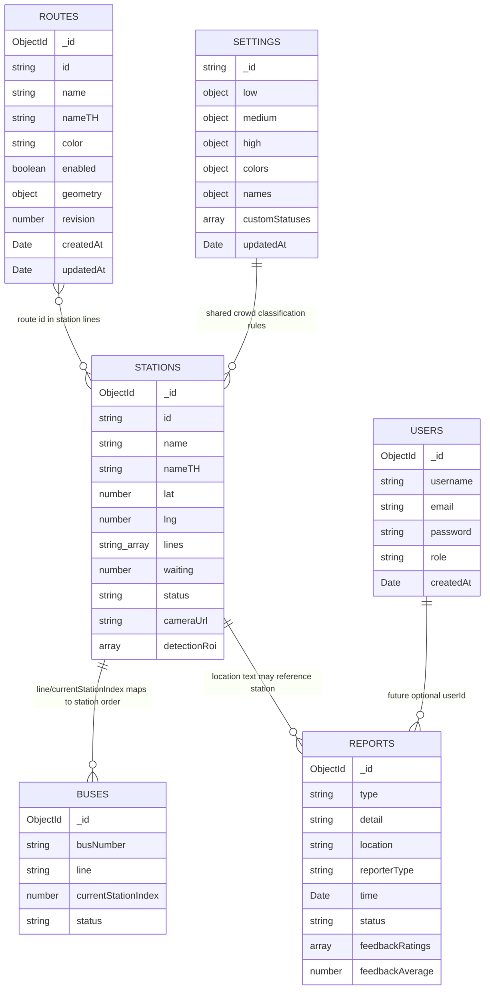

# ER And Data Relationship: MFU Shuttle Bus

ระบบใช้ MongoDB จึงไม่มี foreign key แบบ relational database แต่มี logical relationship ระหว่าง collections ตามการใช้งานของ API และ UI

## 1. Collections

- `users`
- `stations`
- `buses`
- `reports`
- `routes`
- `settings`

## 2. Logical ER Diagram



## 3. Relationship Explanation

### 3.1 Users To Reports

ปัจจุบัน report ที่สร้างจาก Vue passenger web ถูกบันทึกเป็น guest:

```js
reporterType: "guest"
```

ใน type ของ Admin Web ยังรองรับ field `userId`, `UserId`, `username`, `user` สำหรับ compatibility หรือ future work แต่ route ปัจจุบันไม่ได้ผูก report กับ user โดยตรง

### 3.2 Stations To Buses

รถมี field:

```js
line: "1" หรือ "2"
currentStationIndex: number
```

ส่วนสถานีมี field:

```js
lines: ["line1", "line2"]
```

ความสัมพันธ์เป็น logical mapping ตามสายรถและลำดับสถานีใน frontend/backend seed ไม่ใช่ foreign key

### 3.3 Stations To Detector

Detector ใช้ station id จาก route:

```text
/api/detector/:stationId/...
```

แล้วค้นหาใน collection `stations` ด้วย:

```js
{ id: req.params.stationId }
```

field ที่เกี่ยวข้อง:

- `cameraUrl`
- `detectionRoi`

### 3.4 Reports To Stations

Report มี `location` เป็นข้อความ ไม่ได้บังคับให้เป็น station id ดังนั้น relation กับ stations เป็นแบบ optional/text reference

## 4. Indexes

Indexes ถูกสร้างจาก `docker/mongo-init/001-import-backup.sh` และ seed บางส่วน:

| Collection | Index | Purpose |
|---|---|---|
| `stations` | `{ id: 1 } unique | กัน station id ซ้ำ |
| `stations` | `{ lines: 1 }` | ค้นหาสถานีตามสาย |
| `buses` | `{ busNumber: 1 } unique | กันเลขรถซ้ำ |
| `users` | `{ username: 1 } unique | กัน username ซ้ำ |
| `users` | `{ email: 1 }` | ค้นหาหรือจัดการด้วย email |

## 5. Data Cardinality

| Relationship | Cardinality | หมายเหตุ |
|---|---|---|
| Station -> Bus | 1 to many แบบ logical | รถหลายคันอยู่ในสายที่ผ่านสถานีเดียวกันได้ |
| User -> Report | 1 to many ในอนาคต | ปัจจุบัน report เป็น guest |
| Station -> Detector process | 1 to 0/1 runtime | Detector start ได้เมื่อสถานีมี `cameraUrl` |
| Station -> Lines | many to many แบบ embedded array | สถานีหนึ่งอยู่ได้หลายสาย |

## 6. Data Flow Diagram

```text
Passenger Web initial load / resync
  -> /api/public-data -> shared cache -> stations + routes + settings
  -> /api/buses/snapshot -> GPS snapshot cache

Node Backend -> Supabase private Broadcast (mfu-buses)
  -> buses.updated -> Passenger Web + Admin Web
  -> public.updated -> Passenger Web station counts/status

Admin Settings
  -> GET/PUT /api/settings/crowd-thresholds (Admin JWT)
  -> settings (_id: crowd-thresholds)

Legacy public station/bus APIs remain available:
  /station/:line -> stations + settings
  /api/buses -> bus feed

Passenger App
  -> /api/report
  -> reports

Admin Web
  -> /station/admin/*
  -> stations

Admin Web
  -> /auth/admin/*
  -> users

Admin Web
  -> /api/detector/:stationId/*
  -> stations.cameraUrl + stations.detectionRoi
  -> detector runtime frame
```

## 7. Notes For Report Book

ถ้าต้องแปลงเป็น ER Diagram ในรูปเล่มบทที่ 3 สามารถอธิบายว่า MongoDB เป็น document database และใช้ logical relationship แทน foreign key โดย collections หลักคือ `users`, `stations`, `buses`, `reports`, `routes`, `settings`

### ความสัมพันธ์ Settings และ Routes

`settings` เป็นกฎร่วมสำหรับคำนวณสถานะจาก `stations.waiting` ไม่ได้ผูก foreign key กับแต่ละสถานี ส่วน `stations.lines` อ้างถึง `routes.id` แบบ logical mapping
`routes.geometry` เป็น GeoJSON LineString จุดเรียง `[longitude, latitude]`; มี unique index ของ `routes.id` สร้างใน `services/routes.js`
Supabase Broadcast เป็นช่องส่งข้อมูล ไม่ใช่ฐานข้อมูลหลักหรือที่เก็บประวัติของ collections เหล่านี้
